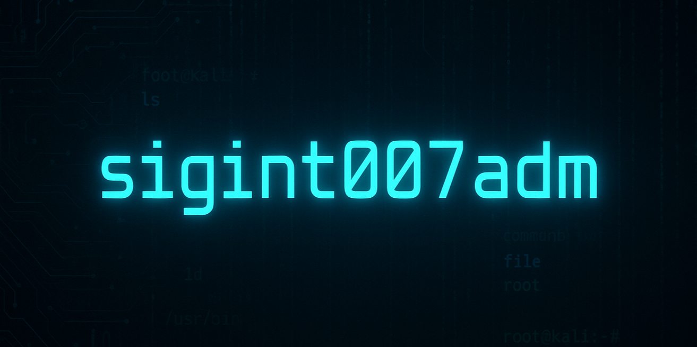

# 🕵️ sigint007adm  

**Ciberseguridad | Optimización de PCs | Personalización IT**  

Bienvenido a mi laboratorio digital.  
Soy un técnico IT con 5 años de experiencia en entornos críticos (hospitales), apasionado por tres áreas que combinadas ofrecen una propuesta única:  

- 🔐 **Ciberseguridad** → Hardening, privacidad, detección de amenazas.  
- ⚡ **Optimización y Rendimiento** → PCs más rápidos, estables y listos para gaming o trabajo intensivo.  
- 🎨 **Personalización & Trucos IT** → Ajustes finos y hacks para llevar tu sistema al siguiente nivel.  

Mi objetivo: **que cualquier usuario o pequeño negocio pueda tener un equipo más seguro, veloz y adaptado a sus necesidades**.  

---

## 📂 Repositorios Principales  

🔐 **[Ciberseguridad](https://github.com/sigint007adm/sigint007adm-cybersec)**  
Scripts y módulos de hardening, privacidad y herramientas prácticas para usuarios y negocios.  
Ejemplos: Windows/Linux hardening, reglas de firewall, detección de procesos sospechosos.  

⚡ **[Optimización & Personalización](https://github.com/sigint007adm/sigint007adm-optimize)**  
Tweaks de Windows 10/11, Linux y mods visuales.  
Ejemplos: optimización de arranque, gaming mode, debloat, temas personalizados.  

💡 **[Trucos & Consejos IT](https://github.com/sigint007adm/sigint007adm-tips)**  
Guías rápidas y útiles para usuarios y técnicos.  
Ejemplos: backups simples, productividad en Windows/Linux, navegación segura.  

---

## 🛠️ Tech Stack  

`Windows` · `Linux` · `Networking` · `Cybersecurity` · `Hardening` · `Optimization` · `Automation` · `Scripting`  

---

## 📬 Contacto  

- 🐦 Twitter/X → [@sigint007adm](https://twitter.com/sigint007adm)  
- 💼 GitHub → [sigint007adm](https://github.com/sigint007adm)  
- 📧 Email → *sigint007adm@proton.me*  

---

## ⚡ Filosofía  

> **Máximo rendimiento, mínima superficie de ataque.**  
> Tu PC no solo debe ser rápido y bonito, también debe estar blindado.  

---

## 🚀 Próximos pasos  

✔ Subida de herramientas de hardening para Windows/Linux.  
✔ Scripts de optimización de arranque en Windows 10/11.  
✔ Guías rápidas de ciberseguridad y productividad para usuarios finales.  

---

⭐ **Si algún proyecto te resulta útil, considera darme una estrella.**  
Esto me ayuda a seguir creando herramientas gratuitas para la comunidad.  

---

## 📊 GitHub Stats

---

## 🌐 Web

(En desarrollo)
